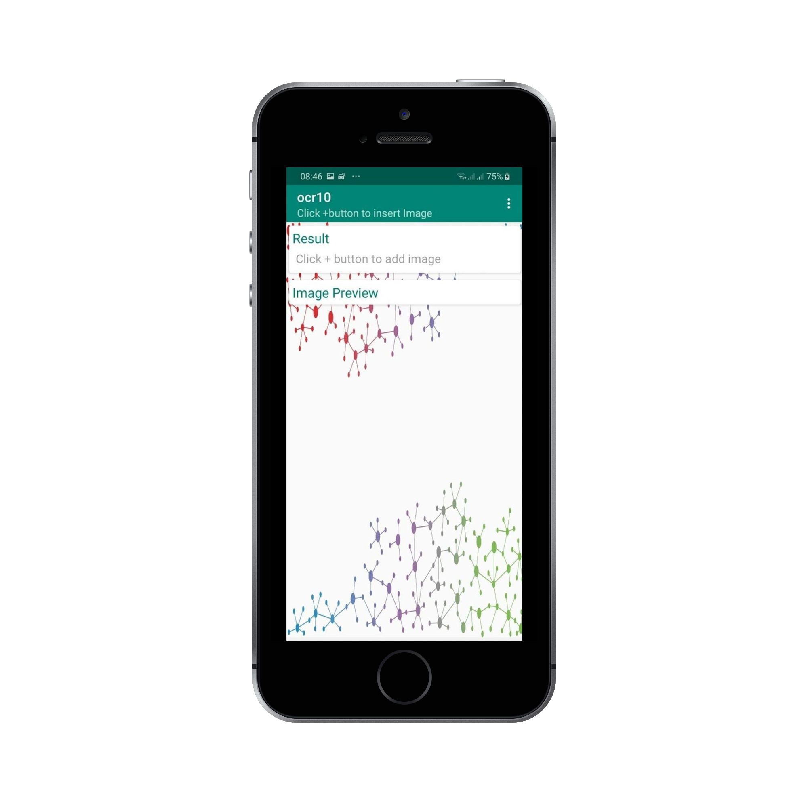
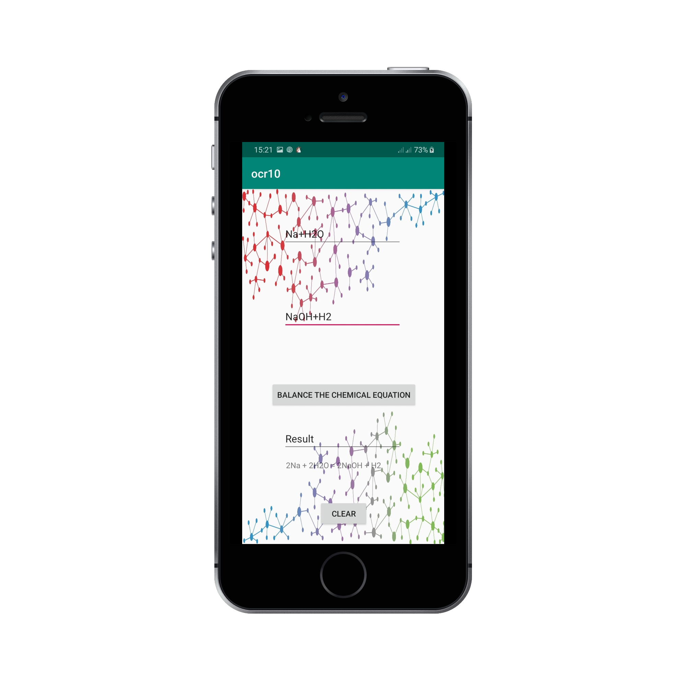
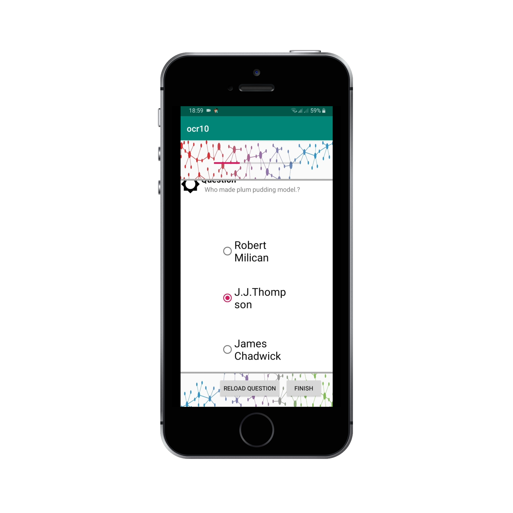
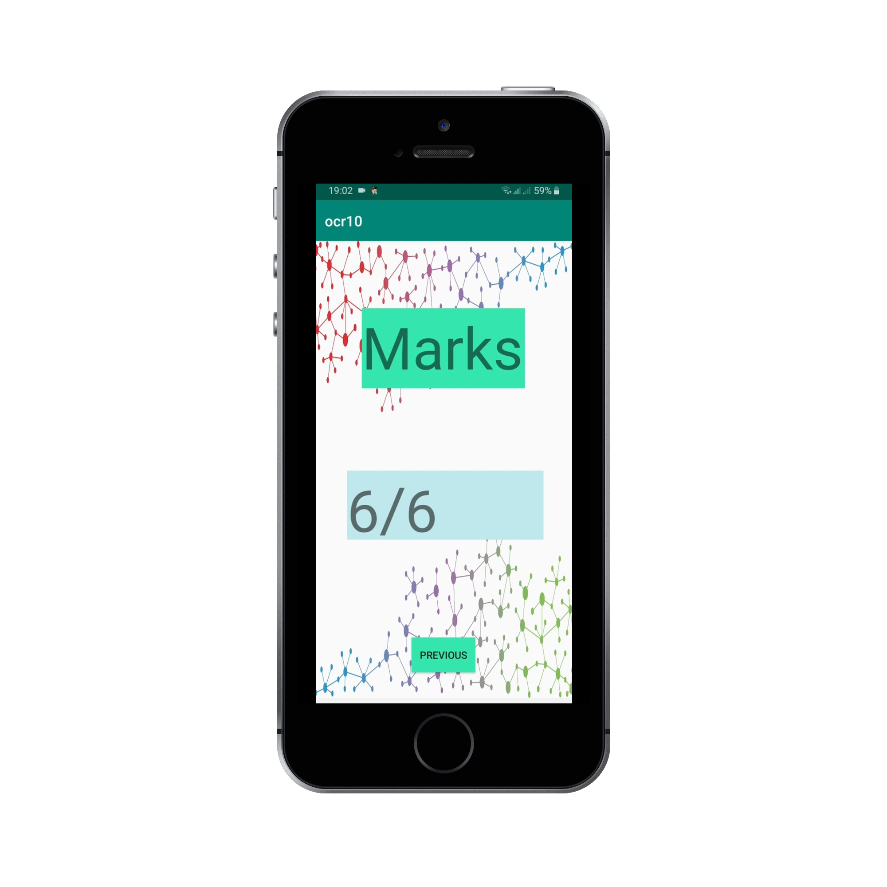

## Chemique3D

An android application that allows the user to perform basic chemical bonding, inorganic chemical reactions, and get a three-dimensional view of chemical bonds and resultants of chemical reactions and chemical equation balancing. The additional section which contains basic inorganic chemistry questions and answers will allow the user to evaluate their knowledge on the subject. 

## Application Screenshots

g

